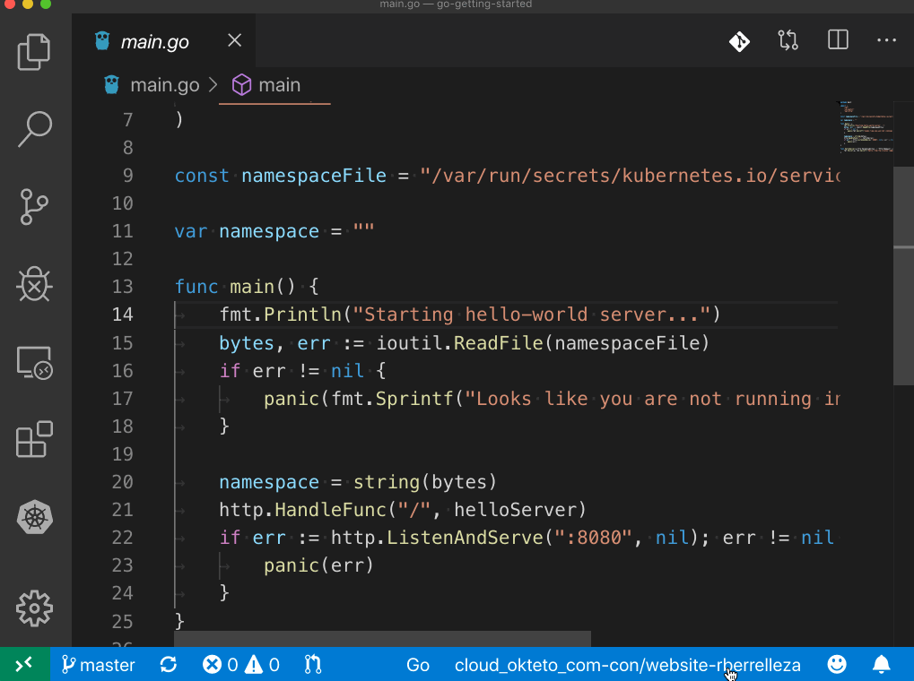

# Kubernetes Context

This extension allows you to manage your Kubernetes context directly from VS Code. This includes: 

1. Displaying your current Kubernetes context in VS Code's status bar
1. Switch your current context by clicking on the status bar and selecting a new one. 

## Requirement

You must have a valid `${HOME}/.kube/config` file, or the `$KUBECONFIG` environment variable set.

## Contributions

Issues, questions or ideas? Head over to our [github repository](https://github.com/okteto/kubernetes-context) and contribute!